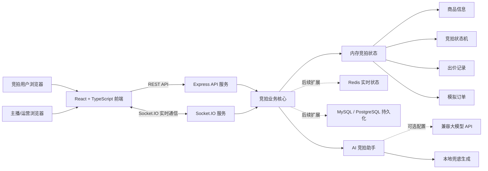
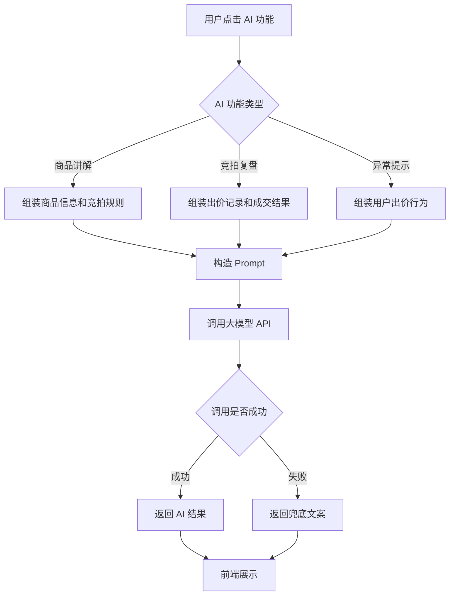

# 抖音电商 AI 全栈挑战赛 - 成果演示 DEMO

> 说明：本文档用于最终提交页信息整理。带有 `待填写` 的内容需要在正式提交前补充真实信息。当前代码项目已完成“实时竞拍”全栈 MVP，并接入 AI 竞拍助手接口；未配置模型 API 时会使用本地兜底策略保证演示稳定。

## 0. 当前提交前状态

已完成：

- 4300 单端口本地演示服务可启动。
- 标准演示数据已恢复为 `live-1` 珠宝专场和 `live-2` 腕表专场。
- `demo-host / demo123` 可看到两个标准演示直播间。
- 演示商品图片使用本地静态资源 `/static/jewelry.jpg` 和 `/static/watch.jpg`，避免外网图片加载失败。
- `npm run typecheck`、`npm run build` 和 `npm --workspace apps/server run test:integration` 已通过。

正式提交前仍需人工补充：

- 团队名称、成员姓名、学校、专业和真实分工。
- 在线 Demo 链接或演示录屏链接。
- 源代码仓库链接、最终分支名、最后提交 hash 和提交时间。
- 如需要公开部署，还需补充生产 API 地址、HTTPS 域名和体验账号说明。

## 1. 课题名称

基于 AI 辅助的直播电商实时竞拍系统

备选名称：

- 实时竞拍大师：面向直播电商的 AI 辅助竞拍系统
- 基于 WebSocket 与 AI 助手的直播电商实时竞拍系统
- 面向抖音电商场景的 AI 全栈实时竞拍 DEMO

建议最终提交页名称保持为：

```text
实时竞拍大师：面向直播电商的 AI 辅助竞拍系统
```

## 2. 团队名称与成员名单

团队名称：待填写

| 成员姓名 | 学校 | 专业 | 角色 |
| --- | --- | --- | --- |
| 待填写 | 待填写 | 待填写 | 产品设计 / 文档 |
| 待填写 | 待填写 | 待填写 | 前端开发 |
| 待填写 | 待填写 | 待填写 | 后端开发 |
| 待填写 | 待填写 | 待填写 | AI 能力 / 测试部署 |

如个人完成，可改为：

| 成员姓名 | 学校 | 专业 | 角色 |
| --- | --- | --- | --- |
| 待填写 | 待填写 | 待填写 | 全栈开发、产品设计、测试与文档 |

## 3. 分工说明

| 成员 | 分工 |
| --- | --- |
| 待填写 | 负责前端页面开发，包括直播间竞拍控制台、商品展示、出价表单、出价记录、订单状态展示 |
| 待填写 | 负责后端服务开发，包括 REST API、Socket.IO 实时通信、竞拍状态机、出价校验、订单生成 |
| 待填写 | 负责 AI 能力接入，包括商品讲解生成、竞拍复盘总结、异常出价提示等功能 |
| 待填写 | 负责测试、部署、演示视频录制、README 和提交文档整理 |

## 4. 核心功能清单

1. 直播竞拍商品展示  
   展示竞拍商品图片、名称、描述、当前最高价、最低加价、封顶价和参与人数。

2. 实时出价与广播  
   用户通过 Socket.IO 提交出价，后端校验后向所有在线客户端广播最新竞拍快照。

3. 竞拍规则与状态机  
   支持待开始、竞拍中、已成交、已流拍、已取消等状态，后端统一处理状态流转。

4. 自动延时与封顶成交  
   在倒计时最后阶段出现有效出价时自动延长结束时间；出价达到封顶价时立即成交。

5. 模拟订单与支付  
   竞拍成交后自动生成模拟订单，用户可以完成模拟支付，系统同步更新订单状态。

6. AI 辅助能力  
   支持 AI 生成商品直播讲解词、AI 生成竞拍复盘总结、AI 提示异常出价风险。

## 5. 端到端使用流程

1. 用户打开系统首页，进入模拟直播电商竞拍界面。
2. 页面自动连接后端实时竞拍服务，并拉取当前竞拍商品和竞拍状态。
3. 主播或运营人员点击“开始/重开竞拍”，系统初始化竞拍倒计时和当前价格。
4. 用户填写昵称和出价金额，点击出价按钮提交竞拍请求。
5. 后端校验竞拍状态、最低加价、封顶价和结束时间，校验通过后更新最高价。
6. 系统通过 Socket.IO 将最新价格、领先用户、出价记录和倒计时同步给所有客户端。
7. 如果用户在最后阶段出价，系统自动延长竞拍时间；如果达到封顶价，系统立即成交。
8. 竞拍成交后系统生成模拟订单，用户点击模拟支付后订单状态变为已支付。
9. 主播可以使用 AI 竞拍助手生成商品讲解词、竞拍复盘或异常出价提示。

## 5.1 本地 Demo 演示步骤

演示前准备：

```bash
cd /home/zyy/realtime-auction-master
npm install
npm run typecheck
npm --workspace apps/web run build
env PORT=4300 CLIENT_URL=http://localhost:4300 npm --workspace apps/server run dev
```

默认访问：

```text
主播端：http://localhost:4300/host?liveRoomId=live-1
Web 观众预览：http://localhost:4300/live/live-1
小程序：微信开发者工具打开 apps/miniprogram
后端：http://localhost:4300
```

建议同时打开 Web 主播端、Web 观众预览页和微信开发者工具：

1. 主播端登录商家账号，例如 `demo-host / demo123`。
2. 在“商品导入”上传 `docs/product-import-template.csv`，确认商品队列出现导入商品。
3. 选择队列中的商品开始竞拍，Web 观众预览页应同步显示竞拍中。
4. 小程序首页先注册买家，再登录进入 `live-1` 专场。
5. 小程序或 Web 观众预览页提交出价，例如 150 元、180 元，主播端应实时看到最高价和出价记录更新。
6. 在倒计时最后 10 秒内出价，页面应显示自动延时，延时次数增加。
7. 出价达到商品封顶价，竞拍应立即变为已成交，并生成待支付订单。
8. 点击“模拟支付”，订单状态应变为已支付，多个窗口同步更新。
9. 分别点击 AI 商品讲解词、AI 竞拍复盘、异常出价提示，确认未配置模型 API 时也能返回本地兜底内容。

演示时重点说明：当前项目是“模拟直播电商场景的实时竞拍 MVP”，不是完整抖音电商平台；真实抖音接入、真实支付、Redis 高并发和数据库持久化属于后续扩展。

## 6. 在线 Demo 链接

在线 Demo：待填写

如部署到 Vercel / Netlify / Render / Railway，可填写：

```text
前端地址：待填写
后端地址：待填写
商家体验账号：demo-host / demo123
买家体验账号：小程序首页先注册，再登录
```

如果暂时无法提供公网 Demo，可提供录屏链接作为替代：

```text
演示录屏：待填写
```

## 7. 演示视频链接

演示视频：待填写

建议视频控制在 3 分钟左右，内容顺序如下：

1. 10 秒：介绍项目名称和解决的问题。
2. 30 秒：展示直播竞拍页面和商品信息。
3. 60 秒：展示多用户实时出价和价格广播。
4. 30 秒：展示自动延时和封顶成交。
5. 30 秒：展示成交订单和模拟支付。
6. 20 秒：展示 AI 辅助能力，例如商品讲解词生成或竞拍复盘总结。
7. 20 秒：总结项目亮点和后续扩展方向。

建议旁白脚本：

```text
大家好，我们的项目是“实时竞拍大师：面向直播电商的 AI 辅助竞拍系统”。
它模拟直播电商中的限时竞拍场景，重点解决多用户实时出价、竞拍规则校验、最后阶段自动延时、封顶成交和成交后订单处理。
现在我打开两个浏览器窗口模拟不同用户，点击开始竞拍后，两个窗口会通过 Socket.IO 同步当前最高价、倒计时、领先用户和出价记录。
当用户在最后 10 秒内出价，系统会自动延长竞拍时间，避免最后一秒抢拍带来的不公平。
当出价达到封顶价时，后端状态机会立即成交并生成模拟订单，用户可以完成模拟支付。
最后展示 AI 竞拍助手：它可以生成商品讲解词、竞拍复盘和异常出价提示；即使没有配置模型 API，也会使用本地兜底策略保证演示不中断。
当前版本是实时竞拍 MVP，后续可以扩展真实平台接入、真实支付、数据库持久化和 Redis 高并发竞价能力。
```

## 8. 源代码仓库链接

源代码仓库：待填写

本地项目路径：

```text
/home/zyy/realtime-auction-master
```

分支说明：

```text
main：初始实时竞拍 Demo
feat-ai-auction-assistant：AI 竞拍助手 MVP
feat-test-and-demo：后端稳定性、测试清单和最终演示材料
```

最后提交记录：待最终推送后填写 `git log -1 --oneline`

备注：项目 Git 元数据使用独立目录管理，本地演示时以 `/home/zyy/realtime-auction-master` 或对应 worktree 为准。正式提交前需要补充 GitHub / GitLab 仓库地址、最终分支名、最后提交 hash 和提交时间。

## 9. README / 运行说明

### 9.1 项目简介

实时竞拍大师是一个面向直播电商场景的实时竞拍全栈 DEMO。系统模拟直播间中的商品竞拍流程，支持用户实时出价、多人同步更新、自动延时、封顶成交、异常取消和模拟订单支付。

### 9.2 依赖环境

- Node.js 18 或更高版本
- npm
- 现代浏览器，例如 Chrome、Edge

### 9.3 启动步骤

进入项目目录：

```bash
cd /home/zyy/realtime-auction-master
```

安装依赖：

```bash
npm install
```

启动前后端：

```bash
npm --workspace apps/web run build
env PORT=4300 CLIENT_URL=http://localhost:4300 npm --workspace apps/server run dev
```

默认访问地址：

```text
主播端：http://localhost:4300/host?liveRoomId=live-1
Web 观众预览：http://localhost:4300/live/live-1
后端：http://localhost:4300
```

### 9.4 目录结构

```text
realtime-auction-master
├── apps
│   ├── server
│   │   └── src
│   │       ├── index.ts      后端入口、REST API、Socket.IO 事件
│   │       ├── store.ts      竞拍状态、出价规则、订单逻辑
│   │       └── types.ts      后端类型定义
│   └── web
│       └── src
│           ├── App.tsx       前端主页面
│           ├── styles.css    页面样式
│           └── types.ts      前端类型定义
├── docs
│   ├── development-plan.md
│   └── final-demo-submission.md
├── package.json
└── README.md
```

### 9.5 配置说明

后端端口：

```text
PORT=4300
```

前端允许访问地址：

```text
CLIENT_URL=http://localhost:4300
```

前端 API 地址：

```text
稳定单端口模式下无需单独配置 VITE_API_URL
```

## 10. 系统架构图



## 11. 大模型 / AI 能力使用说明

### 11.1 当前状态

当前代码仓库已接入 AI 竞拍助手接口，支持商品讲解词生成、竞拍复盘总结和异常出价提示。后端提供兼容 Chat Completions 格式的大模型调用封装，可通过环境变量配置模型服务；如果没有配置模型 API 或调用失败，系统会使用本地兜底策略生成结果，保证演示流程不中断。

### 11.2 建议接入的 AI 能力

当前已接入以下 3 个轻量 AI 能力：

1. AI 商品讲解生成  
   输入商品名称、描述、起拍价、封顶价和竞拍规则，生成适合直播间展示的主播讲解词。

2. AI 竞拍复盘总结  
   竞拍结束后，根据出价记录、成交价格、参与人数和延时次数生成一段竞拍结果总结。

3. AI 异常出价提示  
   根据出价频率、价格跳变、重复提交等行为给出风险提示，辅助主播判断是否需要取消竞拍。

### 11.3 AI 在系统中的位置

```text
前端点击 AI 生成按钮
→ 后端接收商品或竞拍上下文
→ 后端调用大模型 API 或本地兜底生成
→ 返回讲解词、复盘总结或风险提示
→ 前端展示 AI 结果
```

### 11.4 可选模型与 API

当前接口通过以下环境变量配置兼容 Chat Completions 格式的大模型服务：

```text
AI_API_URL=https://api.example.com/v1/chat/completions
AI_API_KEY=your_api_key
AI_MODEL=your_model_name
```

可选择的模型服务包括：

- OpenAI API
- 通义千问
- 豆包大模型
- DeepSeek
- 其他兼容 OpenAI SDK 的模型服务

### 11.5 Prompt 设计示例

商品讲解生成 Prompt：

```text
你是一名直播电商主播助理。
请根据以下商品和竞拍规则，生成一段 80 字以内的直播讲解词。
要求：语言自然、有互动感、不要夸大功效、不要承诺保值或收益。

商品名称：{{productName}}
商品描述：{{description}}
起拍价：{{startPrice}}
最低加价：{{incrementStep}}
封顶价：{{ceilingPrice}}
竞拍时长：{{durationSeconds}} 秒
```

竞拍复盘总结 Prompt：

```text
你是直播电商运营分析助手。
请根据以下竞拍数据生成一段简洁复盘，总结竞拍热度、成交结果和运营建议。

商品：{{productName}}
成交状态：{{status}}
最终价格：{{finalPrice}}
参与人数：{{participantCount}}
出价次数：{{bidCount}}
延时次数：{{extendCount}}
```

异常出价提示 Prompt：

```text
你是竞拍风控助手。
请根据以下出价行为判断是否存在异常风险，并给出风险等级和原因。
风险等级只能是：低、中、高。

当前最高价：{{currentPrice}}
最新出价：{{newBidPrice}}
用户最近出价次数：{{recentBidCount}}
距离上一次出价间隔：{{intervalSeconds}} 秒
是否达到封顶价：{{reachCeiling}}
```

## 12. 关键工程难点与解决方案

### 12.1 多用户实时出价同步

难点：多个用户同时参与竞拍时，前端需要及时看到当前最高价、领先用户、出价记录和竞拍状态。

解决方案：后端使用 Socket.IO 建立实时连接，用户进入页面后加入同一个竞拍房间。每次成功出价后，后端向房间内所有客户端广播最新竞拍快照，前端统一刷新页面状态。

### 12.2 竞拍状态一致性

难点：竞拍过程中可能出现出价、倒计时结束、封顶成交、主播取消等多个事件，需要避免状态混乱。

解决方案：后端使用状态机管理竞拍生命周期，只允许合法状态流转。出价逻辑统一由服务端处理，前端不能直接修改竞拍状态。成交后由服务端生成订单。

### 12.3 最后一秒出价与自动延时

难点：用户在倒计时最后几秒出价，可能造成竞拍体验不公平。

解决方案：后端判断有效出价发生时距离结束时间是否小于延时阈值。如果满足条件且未超过最大延时次数，则自动延长结束时间，并通过实时消息同步给所有客户端。

### 12.4 封顶价并发成交

难点：多个用户几乎同时出价到封顶价时，必须保证最终只有一个用户成交。

解决方案：当前 MVP 运行在 Node.js 单进程中，出价逻辑同步处理，请求按服务端处理顺序依次执行。第一个成功达到封顶价的用户会将竞拍状态改为 SOLD 并生成订单，后续请求会因为状态已结束而失败。后续扩展可使用 Redis Lua 或数据库事务进一步保证原子性。

### 12.5 AI 输出安全与稳定

难点：AI 生成的商品话术可能存在夸大宣传、过度承诺或不符合直播电商合规要求的问题。

解决方案：在 Prompt 中明确限制 AI 不得承诺保值、收益或绝对效果；后端可对输出内容进行长度限制和敏感词过滤；前端将 AI 内容定位为“建议文案”，由主播确认后使用。

## 13. 项目亮点 / 创新点

1. 实时竞拍闭环完整  
   系统覆盖商品展示、开始竞拍、实时出价、自动延时、成交结算、订单生成和模拟支付。

2. 竞拍规则由服务端统一校验  
   最低加价、封顶价、状态流转、倒计时结束等关键规则全部由后端处理，降低前端篡改风险。

3. AI 与直播竞拍场景结合  
   可通过 AI 商品讲解、竞拍复盘和异常出价提示增强主播运营效率，使项目符合 AI 全栈挑战赛定位。

## 14. 其余材料

### 14.1 性能指标 / 压测结果

当前状态：待最终彩排后补充实测值。MVP 阶段以单机 Node.js 内存状态为主，性能指标用于演示稳定性说明，不代表生产级高并发竞拍能力。

建议补充以下指标：

| 指标 | 建议测试方式 | 结果 |
| --- | --- | --- |
| 首屏加载时间 | 浏览器 DevTools | 待填写 |
| 出价接口平均响应时间 | 手工测试或脚本压测 | 待填写 |
| Socket.IO 广播延迟 | 多浏览器观察或埋点 | 待填写 |
| 并发用户数 | 模拟 50 / 100 用户出价 | 待填写 |
| AI 调用平均耗时 | 记录模型 API 返回时间 | 待填写 |
| AI 调用成功率 | 成功次数 / 总调用次数 | 待填写 |

建议最终提交前至少补充以下本地验证结果：

- `npm run typecheck` 是否通过。
- `npm run build` 是否通过。
- 两个浏览器窗口是否可以同步竞拍状态。
- 未配置 AI 环境变量时三个 AI 功能是否都返回兜底结果。
- 达到封顶价后是否只生成一个订单。

### 14.2 Prompt 策略 / Agent 流程图



失败兜底机制：

- 模型接口超时：返回固定模板文案。
- 模型返回为空：提示用户稍后重试。
- 输出过长：截断到页面可展示范围。
- 出现敏感词：提示需要人工修改。

### 14.3 评测方案与样例结果

样例输入：

```json
{
  "productName": "天然翡翠吊坠",
  "description": "模拟直播间竞拍商品，适合用于演示实时出价、自动延时和封顶成交流程。",
  "startPrice": 0,
  "incrementStep": 100,
  "ceilingPrice": 3000,
  "durationSeconds": 90
}
```

样例输出：

```text
今晚直播间这款天然翡翠吊坠正在竞拍，0 元起拍，每次最低加价 100 元，喜欢的朋友可以关注当前最高价，把握出价时机。
```

人工评估维度：

| 维度 | 说明 |
| --- | --- |
| 准确性 | 是否正确引用商品和竞拍规则 |
| 简洁性 | 是否适合直播间快速展示 |
| 合规性 | 是否避免夸大宣传和收益承诺 |
| 可用性 | 主播是否可以直接参考使用 |

### 14.4 用户反馈 / 内测记录

当前状态：待补充。

建议收集 3-5 条同学或老师试用反馈：

| 反馈人 | 反馈内容 | 处理结果 |
| --- | --- | --- |
| 待填写 | 多个浏览器同时出价时价格能实时同步 | 已验证 |
| 待填写 | 倒计时最后阶段自动延时比较直观 | 已保留 |
| 待填写 | 希望增加 AI 直播话术生成 | 已实现 |

## 15. 提交前检查清单

| 检查项 | 状态 |
| --- | --- |
| 项目名称与最终提交页一致 | 待确认 |
| 团队名称和成员信息完整 | 待填写 |
| 分工说明完整 | 待填写 |
| 核心功能清单 3-6 条 | 已整理 |
| 端到端流程 5-8 句 | 已整理 |
| 在线 Demo 链接 | 待填写 |
| 演示视频链接 | 待填写 |
| 源代码仓库链接 | 待填写 |
| README 和运行说明 | 已整理，建议同步更新 README |
| 系统架构图 | 已整理 |
| AI 能力说明 | 已整理，代码已接入 |
| 工程难点和解决方案 | 已整理 |
| 项目亮点 3 条以内 | 已整理 |
| 性能指标或测试结果 | 待补充 |
| Prompt 策略和兜底机制 | 已整理 |
| 评测样例 | 已整理 |
| 用户反馈 | 待补充 |
