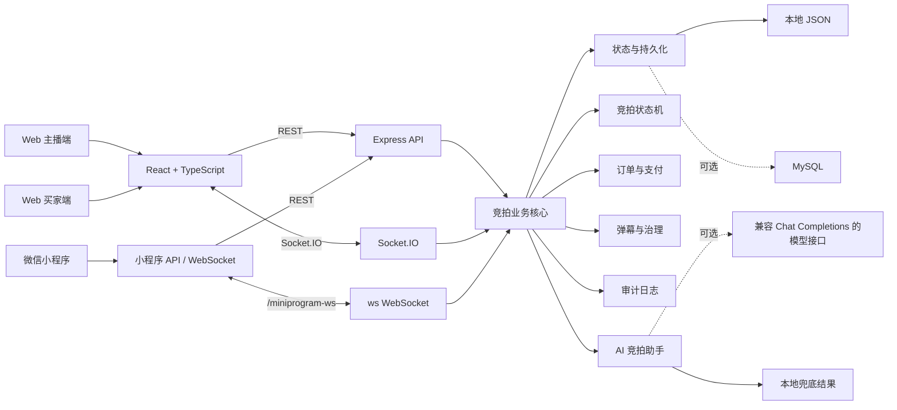

# 抖音电商 AI 全栈挑战赛 - 成果演示 Demo

本文档按当前仓库版本整理最终提交页、答辩演示和录屏材料。项目已经完成 Web 主播端、Web 买家端、微信小程序买家端、实时竞拍、弹幕互动、模拟订单、AI 竞拍助手和本地稳定演示数据。

仍需人工补充的内容只有：团队真实信息、公开视频链接、线上公网 Demo 地址和最终用户反馈。

## 1. 项目信息

| 项目 | 内容 |
| --- | --- |
| 项目名称 | 实时竞拍大师：面向直播电商的 AI 辅助竞拍系统 |
| 课题方向 | AI + 直播电商 + 实时竞拍 |
| 项目类型 | 全栈 Demo / MVP |
| 远端仓库 | `https://github.com/fafa-zero/realtime-auction-master.git` |
| 本地路径 | `/home/zyy/realtime-auction-master` |
| 当前分支 | `main` |
| 最新提交确认 | 最终提交后执行 `git log -1 --oneline` 确认 |
| 推荐演示端口 | `4300` |
| 演示模式 | 后端单端口托管 Web、API、Socket.IO、静态图片和小程序 WebSocket |

最终提交页推荐项目名：

```text
实时竞拍大师：面向直播电商的 AI 辅助竞拍系统
```

一句话介绍：

```text
实时竞拍大师是一个面向直播电商场景的 AI 辅助实时竞拍系统，支持主播开拍、买家实时出价、弹幕互动、封顶成交、模拟订单支付和 AI 讲解/复盘/风控提示。
```

## 2. 团队信息

团队名称：待人工补充

| 成员姓名 | 学校 | 专业 | 角色 |
| --- | --- | --- | --- |
| 待人工补充 | 待人工补充 | 待人工补充 | 产品设计、前端开发、后端开发、AI 能力、测试与文档 |

如果是多人团队，可按实际情况拆分为：

| 成员姓名 | 学校 | 专业 | 分工 |
| --- | --- | --- | --- |
| 待人工补充 | 待人工补充 | 待人工补充 | 产品设计、演示流程、提交材料 |
| 待人工补充 | 待人工补充 | 待人工补充 | Web 主播端、Web 买家端、小程序页面 |
| 待人工补充 | 待人工补充 | 待人工补充 | 后端 API、Socket.IO、竞拍状态机、订单逻辑 |
| 待人工补充 | 待人工补充 | 待人工补充 | AI 助手、测试验证、部署与录屏 |

## 3. 当前完成状态

已完成：

- `4300` 单端口本地演示模式。
- Web 主播端：登录、直播间管理、商品队列、开拍/取消、订单、弹幕治理、AI 助手。
- Web 买家端：登录/注册、观看直播间、实时出价、弹幕、订单和模拟支付。
- 微信小程序买家端：复用 Web 买家账号，进入同一直播间竞拍、发弹幕、查看订单。
- 多直播间隔离：`live-1` 珠宝严选好物专场、`live-2` 腕表收藏好物专场。
- 本地静态演示图片：`/static/jewelry.jpg`、`/static/watch.jpg`。
- 竞拍状态机：待开始、竞拍中、成交、流拍、取消。
- 出价规则：起拍价、最低加价、封顶价、最后阶段自动延时、重复请求去重、风控提示。
- Socket.IO 实时同步 Web 端竞拍和弹幕。
- `/miniprogram-ws` 同步小程序端竞拍和弹幕，REST 接口作为兜底。
- 权限校验：主播不能出价，买家只能支付自己的订单，房主主播才能管理直播间。
- 审计日志：记录开拍、取消、商品管理、弹幕治理、出价、支付和演示重置。
- AI 助手：商品讲解词、竞拍复盘、主播实时话术、异常出价提示。
- 持久化：默认 JSON 文件，可选 MySQL。

已验证命令：

```bash
npm run typecheck
npm run build
npm run test:state-machine
```

验证结果：以上命令已在当前工作区通过。

## 4. 演示账号与直播间

| 角色 | 账号 | 密码 | 用途 |
| --- | --- | --- | --- |
| 商家/主播 | `demo-host` | `demo123` | 登录 Web 主播端，管理 `live-1` 和 `live-2` |
| 买家 | `demo-buyer` | `demo123` | 登录 Web 买家端或小程序，参与出价和支付 |

默认直播间：

| 直播间 ID | 名称 | 推荐入口 |
| --- | --- | --- |
| `live-1` | 珠宝严选好物专场 | `http://localhost:4300/live/live-1` |
| `live-2` | 腕表收藏好物专场 | `http://localhost:4300/live/live-2` |

演示健康检查：

```text
http://localhost:4300/api/health
http://localhost:4300/api/demo/check
```

## 5. 本地 Demo 启动方式

进入项目：

```bash
cd /home/zyy/realtime-auction-master
```

安装依赖：

```bash
npm install
```

推荐启动命令：

```bash
npm run demo
```

该命令会自动执行：

1. 构建 Web。
2. 构建后端。
3. 恢复标准演示数据。
4. 使用 `PORT=4300 CLIENT_URL=http://localhost:4300` 启动后端。
5. 由后端托管前端页面、API、Socket.IO、静态图片和小程序 WebSocket。

默认访问地址：

```text
首页：http://localhost:4300/
主播端：http://localhost:4300/host
主播创建直播间：http://localhost:4300/host/setup
Web 买家端：http://localhost:4300/live/live-1
后端健康检查：http://localhost:4300/api/health
演示健康检查：http://localhost:4300/api/demo/check
```

重置演示数据：

```bash
npm run demo:reset
```

开发模式：

```bash
npm run dev
```

正式答辩或录屏建议使用 `npm run demo`，避免 Vite 端口变化或 WSL 转发不稳定。

## 6. Web 演示流程

建议同时打开两个浏览器窗口：

```text
主播端：http://localhost:4300/host
买家端：http://localhost:4300/live/live-1
```

演示步骤：

1. 主播端使用 `demo-host / demo123` 登录。
2. 选择 `live-1` 珠宝严选好物专场。
3. 在商品队列中选择演示商品，点击开始竞拍。
4. 买家端使用 `demo-buyer / demo123` 登录。
5. 买家提交一个有效出价，主播端和买家端实时同步当前最高价、领先买家和出价记录。
6. 买家发送弹幕，主播端查看弹幕历史和飞屏效果。
7. 主播演示弹幕撤回或屏蔽用户能力。
8. 买家在最后阶段出价，展示自动延时。
9. 买家出价达到封顶价，竞拍自动成交并生成待支付订单。
10. 买家点击模拟支付，订单状态更新为已支付。
11. 主播点击 AI 功能，生成商品讲解词、竞拍复盘、主播实时话术或异常出价提示。

## 7. 微信小程序演示流程

用微信开发者工具打开：

```text
apps/miniprogram
```

联调步骤：

1. 先启动 `npm run demo`。
2. 微信开发者工具打开 `apps/miniprogram`。
3. 开启“不校验合法域名、web-view、TLS 版本以及 HTTPS 证书”。
4. 小程序首页用 `demo-buyer / demo123` 登录，或注册新的买家账号。
5. 进入 `live-1` 直播间。
6. 提交出价，Web 主播端同步显示最新出价。
7. 发送弹幕，Web 和小程序同直播间同步显示。
8. 成交后进入订单页，查看并模拟支付。

小程序默认 API 地址：

```text
http://localhost:4300
http://127.0.0.1:4300
```

注意：Web 页面和小程序必须连接同一个 `4300` 后端实例，才能共享同一套竞拍状态。

## 8. 线上 Demo 与视频链接

当前项目已具备本地稳定演示能力，公网 Demo 需要部署后填写。

| 材料 | 当前填写 |
| --- | --- |
| 在线 Demo 地址 | 待部署后补充 |
| 前端地址 | 待部署后补充 |
| 后端地址 | 待部署后补充 |
| 演示视频链接 | 待录制后补充 |
| 源代码仓库 | `https://github.com/fafa-zero/realtime-auction-master.git` |
| 商家体验账号 | `demo-host / demo123` |
| 买家体验账号 | `demo-buyer / demo123` |

如果暂时没有公网服务，提交时可使用演示录屏替代公网 Demo。

## 9. 3 分钟演示视频脚本

建议视频结构：

| 时间 | 内容 |
| --- | --- |
| 0:00-0:15 | 介绍项目名称和解决的问题 |
| 0:15-0:40 | 展示主播端直播间和商品队列 |
| 0:40-1:20 | 展示买家实时出价和多端同步 |
| 1:20-1:45 | 展示弹幕互动和弹幕治理 |
| 1:45-2:10 | 展示自动延时、封顶成交和订单生成 |
| 2:10-2:35 | 展示模拟支付和订单状态同步 |
| 2:35-2:55 | 展示 AI 商品讲解、竞拍复盘或异常出价提示 |
| 2:55-3:00 | 总结亮点和后续生产化方向 |

旁白参考：

```text
大家好，我们的项目是“实时竞拍大师：面向直播电商的 AI 辅助竞拍系统”。
它模拟直播电商里的限时竞拍场景，重点解决多用户实时出价、竞拍规则校验、弹幕互动、封顶成交和成交后订单处理。
现在我打开主播端和买家端两个窗口。主播登录后选择直播间和商品，点击开始竞拍。
买家登录后提交出价，后端会校验最低加价、封顶价和竞拍状态，然后通过 Socket.IO 同步给所有在线客户端。
在倒计时最后阶段出现有效出价时，系统会自动延长竞拍时间，避免最后一秒抢拍带来的不公平。
当出价达到封顶价时，后端状态机会立即成交并生成模拟订单，成交买家可以完成模拟支付。
项目还提供弹幕互动和治理能力，主播可以撤回弹幕或屏蔽用户。
最后展示 AI 竞拍助手，它可以生成商品讲解词、主播实时话术、竞拍复盘和异常出价提示。即使没有配置模型 API，系统也会使用本地兜底结果保证演示不中断。
当前版本是实时竞拍 MVP，后续可以扩展真实直播流、真实支付、Redis 高并发竞价和更完整的数据库持久化。
```

## 10. 核心功能清单

1. 直播间和商品管理
   主播可以创建直播间、管理商品队列、导入商品、选择商品开拍。

2. 实时竞拍状态机
   后端统一处理待开始、竞拍中、成交、流拍、取消等状态，前端只展示服务端快照。

3. 多端实时同步
   Web 端通过 Socket.IO 同步竞拍和弹幕，小程序通过 `/miniprogram-ws` 同步，REST 请求作为兜底。

4. 竞拍规则校验
   支持最低加价、封顶价、倒计时、最后阶段自动延时、重复请求去重和异常出价风险提示。

5. 成交订单和模拟支付
   封顶价或竞拍结束后生成订单，成交买家可以模拟支付，订单状态同步给主播端和买家端。

6. 弹幕互动与治理
   买家发送弹幕，主播可查看弹幕历史、撤回弹幕、屏蔽用户，相关动作写入审计日志。

7. AI 竞拍助手
   支持商品讲解词、主播实时话术、竞拍复盘和异常出价提示，未配置模型时使用本地兜底。

## 11. 主要接口与实时事件

详细接口见 [docs/api-reference.md](api-reference.md)。

常用 REST 接口：

| 模块 | 接口 |
| --- | --- |
| 健康检查 | `GET /api/health`、`GET /api/demo/check` |
| 登录注册 | `POST /api/auth/web/register`、`POST /api/auth/web/login`、`POST /api/auth/logout`、`GET /api/me` |
| 直播间 | `GET /api/live-rooms`、`GET /api/live-rooms/:liveRoomId`、`POST /api/live-rooms` |
| 商品 | `GET /api/live-rooms/:liveRoomId/products`、`POST /api/live-rooms/:liveRoomId/products/import`、`POST /api/live-rooms/:liveRoomId/products/:productId/start` |
| 竞拍 | `GET /api/live-rooms/:liveRoomId/auction`、`POST /api/live-rooms/:liveRoomId/auction/start`、`POST /api/live-rooms/:liveRoomId/auction/bids`、`POST /api/live-rooms/:liveRoomId/auction/cancel` |
| 订单 | `GET /api/me/orders`、`GET /api/live-rooms/:liveRoomId/orders`、`POST /api/orders/:orderId/pay` |
| 弹幕 | `GET /api/live-rooms/:liveRoomId/danmaku`、`POST /api/live-rooms/:liveRoomId/danmaku`、`POST /api/live-rooms/:liveRoomId/danmaku/:messageId/retract`、`POST /api/live-rooms/:liveRoomId/danmaku/block-user` |
| 审计 | `GET /api/live-rooms/:liveRoomId/audit-logs` |
| AI | `POST /api/ai/product-script`、`POST /api/ai/auction-summary`、`POST /api/ai/host-cue`、`POST /api/ai/bid-risk` |

Socket.IO 主要事件：

```text
auction:join
auction:snapshot
auction:bid
auction:bid-success
auction:extended
auction:ended
auction:cancelled
order:paid
danmaku:history
danmaku:send
danmaku:new
danmaku:retracted
danmaku:user-blocked
```

小程序 WebSocket：

```text
/miniprogram-ws
```

## 12. 系统架构



## 13. AI 能力说明

当前已接入 4 类 AI 能力：

| 能力 | 输入 | 输出 | 兜底策略 |
| --- | --- | --- | --- |
| 商品讲解词 | 商品名称、描述、起拍价、封顶价、竞拍规则 | 适合直播口播的商品讲解 | 未配置模型时返回本地模板文案 |
| 主播实时话术 | 当前竞拍状态、价格、参与人数、出价记录 | 主播可以即时使用的话术建议 | 未配置模型时按当前竞拍状态生成建议 |
| 竞拍复盘 | 成交状态、最终价格、出价次数、延时次数 | 竞拍结果总结和运营建议 | 未配置模型时返回规则化总结 |
| 异常出价提示 | 用户、价格跳变、出价频率、封顶状态 | 风险等级、原因和处置建议 | 未配置模型时使用本地风控规则 |

环境变量：

```bash
AI_API_URL=
AI_API_KEY=
AI_MODEL=
```

未配置模型或模型调用失败时，系统仍会返回本地兜底内容，保证录屏和答辩演示不中断。

Prompt 约束：

- 控制输出长度，适合直播间快速展示。
- 避免承诺保值、收益或绝对效果。
- 将 AI 输出定位为“主播参考建议”，保留人工确认空间。
- 对异常出价输出风险等级和原因，辅助主播判断是否需要取消竞拍或继续观察。

## 14. 工程难点与解决方案

| 难点 | 解决方案 |
| --- | --- |
| 多用户实时同步 | Web 使用 Socket.IO 房间广播，小程序使用 `/miniprogram-ws`，每次有效出价后广播最新快照 |
| 竞拍状态一致性 | 后端统一维护状态机，前端不能直接修改竞拍状态 |
| 最后一秒抢拍 | 有效出价发生在结束前阈值内时自动延时，并限制最大延时次数 |
| 封顶价并发成交 | 当前单机 Node.js 按请求处理顺序同步更新状态，第一个有效封顶出价生成唯一订单 |
| 重复提交 | 使用 `clientRequestId` 做请求去重，避免重复点击产生多条有效出价 |
| 权限隔离 | REST 和 Socket 均使用 token 识别用户，主播不能出价，买家只能支付自己的订单 |
| 小程序联调不稳定 | 小程序依次尝试 `localhost` 和 `127.0.0.1`，并保留 REST 兜底 |
| AI 不可用 | 未配置模型或调用失败时返回本地兜底结果 |

## 15. 数据与持久化

默认演示模式使用 JSON 文件：

```bash
AUCTION_DATA_FILE=data/auction-state.json
AUCTION_STORAGE=json
```

可选 MySQL：

```bash
mysql -u root -p < apps/server/db/mysql-schema.sql
```

```bash
AUCTION_STORAGE=mysql \
MYSQL_HOST=127.0.0.1 \
MYSQL_PORT=3306 \
MYSQL_USER=root \
MYSQL_PASSWORD=your_password \
MYSQL_DATABASE=realtime_auction \
PORT=4300 \
CLIENT_URL=http://localhost:4300 \
npm --workspace apps/server run start
```

当前 MySQL 表按业务实体拆分为直播间、用户、会话、商品、竞拍、出价、订单、历史、弹幕、屏蔽用户和审计日志表。演示阶段使用 `entity_key + data_json` 保存实体快照，便于稳定迁移。

## 16. 测试与验收

当前已执行并通过：

```bash
npm run typecheck
npm run build
npm run test:state-machine
```

建议最终录屏前再执行：

```bash
npm run demo:reset
npm run demo
```

手工验收清单：

| 场景 | 预期结果 | 状态 |
| --- | --- | --- |
| 主播登录 | `demo-host / demo123` 可进入主播控制台 | 已具备 |
| 买家登录 | `demo-buyer / demo123` 可进入买家端 | 已具备 |
| 开始竞拍 | 主播开始竞拍后买家端实时显示竞拍中 | 已具备 |
| 有效出价 | 当前价、领先用户、出价记录多端同步 | 已具备 |
| 自动延时 | 最后阶段出价会延长结束时间 | 已具备 |
| 封顶成交 | 达到封顶价后竞拍变为 `SOLD` 并生成订单 | 已具备 |
| 模拟支付 | 成交买家可支付自己的订单 | 已具备 |
| 弹幕互动 | Web 和小程序同直播间可同步弹幕 | 已具备 |
| 弹幕治理 | 主播可撤回弹幕或屏蔽用户 | 已具备 |
| AI 兜底 | 不配置 AI 环境变量仍能返回结果 | 已具备 |
| 小程序联调 | 微信开发者工具可连接 `4300` 后端 | 已具备 |

## 17. 性能与边界说明

当前项目定位是可演示 MVP，重点是业务闭环和工程结构。

| 指标 | 当前说明 |
| --- | --- |
| 运行模式 | 单机 Node.js 进程 |
| 实时通信 | Socket.IO + ws |
| 数据存储 | JSON 默认，MySQL 可选 |
| 并发能力 | 适合本地演示和答辩；生产高并发需要 Redis、队列和事务存储 |
| AI 调用 | 支持外部模型；未配置时本地兜底 |
| 支付 | 模拟支付，不接真实支付渠道 |
| 直播流 | 当前为演示商品画面，不接真实直播推流 |
| 微信登录 | 当前小程序复用 Web 买家账号；真实微信授权为后续扩展 |

生产化建议：

- 使用 Redis Lua 或数据库事务保证多实例竞价原子性。
- 使用消息队列和 WebSocket 集群支撑高并发广播。
- 接入真实商品库、库存、订单、支付和退款流程。
- 使用正式 HTTPS / WSS 域名和微信小程序合法域名。
- 完善风控策略、敏感词库、后台权限和审计查询。
- 将 MySQL 快照表逐步拆成范式化字段和索引。

## 18. 用户反馈记录

待人工补充 3-5 条真实试用反馈。

| 反馈人 | 反馈内容 | 处理结果 |
| --- | --- | --- |
| 待人工补充 | 多个浏览器同时出价时价格能实时同步 | 当前版本已支持 |
| 待人工补充 | 倒计时最后阶段自动延时比较直观 | 当前版本已支持 |
| 待人工补充 | 希望增加 AI 主播话术生成 | 当前版本已支持 |
| 待人工补充 | 小程序和 Web 可以共用同一买家账号 | 当前版本已支持 |

## 19. 最终提交检查清单

| 检查项 | 状态 |
| --- | --- |
| 项目名称已确定 | 已完成 |
| 核心功能清单已整理 | 已完成 |
| 端到端演示流程已整理 | 已完成 |
| README 已重写 | 已完成 |
| API 文档已整理 | 已完成 |
| 小程序联调说明已整理 | 已完成 |
| 源代码仓库链接已填写 | 已完成 |
| 演示账号已填写 | 已完成 |
| 本地 Demo 启动命令已填写 | 已完成 |
| 类型检查通过 | 已完成 |
| 构建通过 | 已完成 |
| 状态机测试通过 | 已完成 |
| 团队真实信息 | 待人工补充 |
| 在线 Demo 地址 | 待部署后补充 |
| 演示视频链接 | 待录制后补充 |
| 用户反馈 | 待人工补充 |

## 20. 提交命令参考

提交文档更新：

```bash
git status
git add docs/final-demo-submission.md
git commit -m "docs: refresh final demo submission"
git push origin main
```

最终提交前查看最新提交：

```bash
git log -1 --oneline
```
