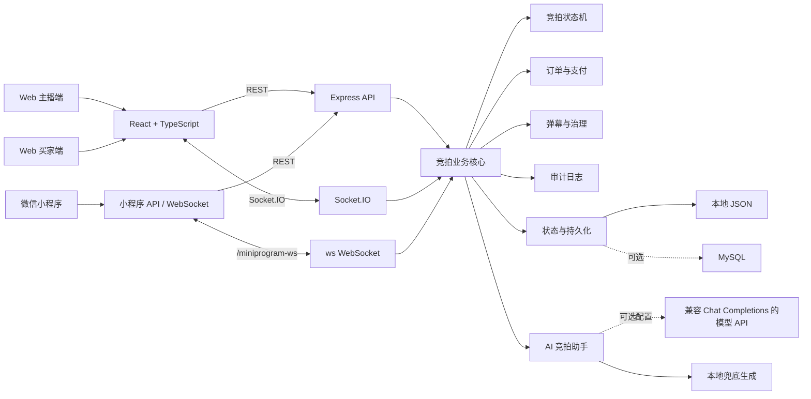
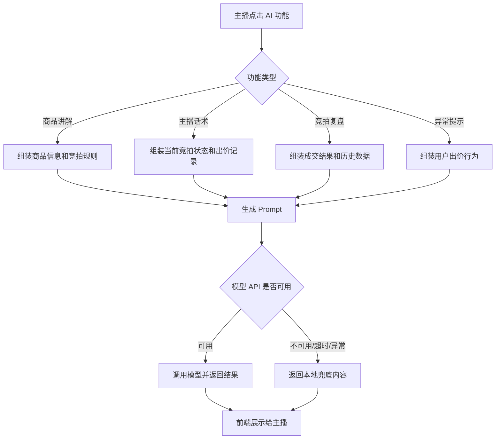

# 抖音电商 AI 全栈挑战赛 - 成果演示 Demo

本文档按最终提交页要求整理，内容基于当前仓库 `/home/zyy/realtime-auction-master`。项目已完成 Web 主播端、Web 买家端、微信小程序买家端、实时竞拍、弹幕互动、模拟订单、AI 竞拍助手和本地稳定演示数据。

仍需人工补充：团队真实姓名/学校/专业、线上公网 Demo 地址、公开视频链接、真实用户反馈。

## 1. 课题名称

```text
实时竞拍大师：面向直播电商的 AI 辅助竞拍系统
```

说明：名称保持与 README 和最终提交页一致，评委可以快速识别项目方向：直播电商、实时竞拍、AI 辅助运营。

一句话简介：

```text
实时竞拍大师是一个面向直播电商场景的 AI 辅助实时竞拍系统，支持主播开拍、买家实时出价、弹幕互动、封顶成交、模拟订单支付和 AI 讲解/复盘/风控提示。
```

## 2. 团队名称与成员名单

团队名称：待人工补充

单人完成版本：

| 成员姓名 | 学校 | 专业 | 角色 |
| --- | --- | --- | --- |
| 待人工补充 | 待人工补充 | 待人工补充 | 全栈开发、产品设计、AI 能力接入、测试与文档 |

多人团队版本，可按实际情况替换：

| 成员姓名 | 学校 | 专业 | 角色 |
| --- | --- | --- | --- |
| 待人工补充 | 待人工补充 | 待人工补充 | 产品设计 / 演示材料 |
| 待人工补充 | 待人工补充 | 待人工补充 | 前端开发 / 小程序开发 |
| 待人工补充 | 待人工补充 | 待人工补充 | 后端开发 / 实时通信 |
| 待人工补充 | 待人工补充 | 待人工补充 | AI 能力 / 测试部署 |

## 3. 分工说明

如小队完成，可使用下表：

| 成员 | 分工说明 |
| --- | --- |
| 待人工补充 | 负责产品设计、用户流程、最终提交材料、演示脚本和录屏规划 |
| 待人工补充 | 负责 Web 主播端、Web 买家端、小程序页面、登录态和交互体验 |
| 待人工补充 | 负责 Express API、Socket.IO、`/miniprogram-ws`、竞拍状态机、订单和权限控制 |
| 待人工补充 | 负责 AI 助手、Prompt 设计、本地兜底策略、测试验证和部署说明 |

如个人完成，可写为：

```text
本人独立完成产品设计、前端页面、后端接口、实时通信、竞拍状态机、AI 助手、本地演示数据、测试验证和文档整理。
```

## 4. 核心功能清单

1. 主播直播间与商品管理
   主播登录后可以创建直播间、管理商品队列、导入商品、选择商品开拍，并查看订单、弹幕和审计日志。

2. 买家实时竞拍
   买家通过 Web 或微信小程序进入直播间，查看商品、倒计时、当前最高价和出价记录，并提交有效出价。

3. 竞拍规则与状态机
   后端统一校验起拍价、最低加价、封顶价、竞拍状态、倒计时、自动延时和重复请求，保证成交状态一致。

4. 多端实时同步
   Web 使用 Socket.IO，同步竞拍快照、出价、成交、支付和弹幕；小程序使用 `/miniprogram-ws`，并保留 REST 兜底。

5. 弹幕互动、订单与模拟支付
   买家可发送弹幕，主播可撤回弹幕或屏蔽用户；封顶成交后自动生成订单，成交买家可以模拟支付。

6. AI 竞拍助手
   系统支持商品讲解词、主播实时话术、竞拍复盘和异常出价提示；当前已接入中科大 LLM 网关，未配置模型 API 或模型调用失败时使用本地兜底结果。

## 5. 端到端使用流程

用户打开系统首页后，主播进入 Web 主播端并使用 `demo-host / demo123` 登录。主播选择 `live-1` 珠宝严选好物专场，确认商品队列中的演示商品并点击开始竞拍。买家通过 Web 买家端或微信小程序进入同一直播间，使用 `demo-buyer / demo123` 登录。买家查看商品信息、当前价格、最低加价、封顶价和倒计时后提交出价。后端校验出价合法性并通过实时通道同步最新竞拍快照，主播端、Web 买家端和小程序端都能看到价格与出价记录更新。买家可以发送弹幕，主播可以查看弹幕历史并进行撤回或屏蔽治理。当买家出价达到封顶价时，系统自动成交并生成待支付订单，成交买家完成模拟支付后订单状态同步更新。主播最后可使用 AI 助手生成商品讲解词、主播实时话术、竞拍复盘或异常出价提示，形成完整演示闭环。

## 6. 在线 Demo 链接

当前项目已具备本地稳定演示能力，公网 Demo 需要部署后填写。

| 材料 | 当前填写 |
| --- | --- |
| 在线 Demo 地址 | 待部署后补充 |
| 本地演示首页 | `http://localhost:4300/` |
| Web 主播端 | `http://localhost:4300/host` |
| Web 买家端 | `http://localhost:4300/live/live-1` |
| 后端健康检查 | `http://localhost:4300/api/health` |
| 演示健康检查 | `http://localhost:4300/api/demo/check` |
| 商家体验账号 | `demo-host / demo123` |
| 买家体验账号 | `demo-buyer / demo123` |

如果没有公网地址，可提交演示录屏作为替代，并在最终提交页说明“当前提供本地 Demo + 录屏展示”。

## 7. 演示视频链接

演示视频链接：待录制后补充。

建议视频长度约 3 分钟，可加速展示，内容顺序如下：

| 时间 | 展示内容 |
| --- | --- |
| 0:00-0:15 | 项目名称、业务场景和解决的问题 |
| 0:15-0:40 | 主播端登录、直播间和商品队列 |
| 0:40-1:20 | 买家端登录、实时出价、多端同步 |
| 1:20-1:45 | 弹幕互动、弹幕撤回和屏蔽用户 |
| 1:45-2:15 | 自动延时、封顶成交、订单生成 |
| 2:15-2:35 | 买家模拟支付和订单状态同步 |
| 2:35-2:55 | AI 商品讲解、主播话术、竞拍复盘或异常出价提示 |
| 2:55-3:00 | 总结项目亮点和生产化扩展方向 |

旁白参考：

```text
大家好，我们的项目是“实时竞拍大师：面向直播电商的 AI 辅助竞拍系统”。
它模拟直播电商中的限时竞拍场景，重点解决多用户实时出价、竞拍规则校验、弹幕互动、封顶成交和成交后订单处理。
现在我打开主播端和买家端两个窗口。主播登录后选择直播间和商品，点击开始竞拍。
买家登录后提交出价，后端会校验最低加价、封顶价和竞拍状态，然后通过 Socket.IO 同步给所有在线客户端。
在倒计时最后阶段出现有效出价时，系统会自动延长竞拍时间，避免最后一秒抢拍带来的不公平。
当出价达到封顶价时，后端状态机会立即成交并生成模拟订单，成交买家可以完成模拟支付。
项目还提供弹幕互动和治理能力，主播可以撤回弹幕或屏蔽用户。
最后展示 AI 竞拍助手，它可以通过中科大 LLM 网关生成商品讲解词、主播实时话术、竞拍复盘和异常出价提示。即使没有配置模型 API，系统也会使用本地兜底结果保证演示不中断。
```

## 8. 源代码仓库链接

| 项目 | 内容 |
| --- | --- |
| 主仓库 | `https://github.com/fafa-zero/realtime-auction-master.git` |
| 当前主分支 | `main` |
| 本地路径 | `/home/zyy/realtime-auction-master` |
| 最终提交记录 | 提交最终版后执行 `git log -1 --oneline` 确认 |

分支说明：

| 分支 | 说明 |
| --- | --- |
| `main` | 当前最终演示版本，包含 Web、Server、小程序、README 和 Demo 文档 |

提交前建议：

```bash
git status
npm run typecheck
npm run build
npm run test:state-machine
git log -1 --oneline
```

## 9. README / 运行说明

README 已重写并放在仓库根目录：[README.md](../README.md)。

### 9.1 项目简介

实时竞拍大师是一个面向直播电商场景的实时竞拍全栈 Demo，包含 Web 主播端、Web 买家端、微信小程序买家端和 Node.js 后端。系统支持实时出价、弹幕互动、竞拍状态机、封顶成交、模拟订单、AI 辅助话术和本地数据持久化。

### 9.2 依赖环境

- Node.js 18 或更高版本
- npm
- 现代浏览器，推荐 Chrome 或 Edge
- 微信开发者工具，小程序联调时需要
- MySQL，可选，仅需要 MySQL 持久化时使用

### 9.3 启动步骤

```bash
cd /home/zyy/realtime-auction-master
npm install
npm run demo
```

`npm run demo` 会构建 Web、构建后端、恢复标准演示数据，并使用 `4300` 单端口启动服务。

常用地址：

```text
首页：http://localhost:4300/
主播端：http://localhost:4300/host
主播创建直播间：http://localhost:4300/host/setup
Web 买家端：http://localhost:4300/live/live-1
健康检查：http://localhost:4300/api/health
演示检查：http://localhost:4300/api/demo/check
```

### 9.4 目录结构

```text
realtime-auction-master
├── apps
│   ├── server        后端 API、实时通信、竞拍状态机、持久化
│   ├── web           Web 主播端和 Web 买家端
│   └── miniprogram   微信小程序买家端
├── data              本地 JSON 演示状态
├── docs              API、测试用例、演示材料和升级计划
├── package.json      npm workspace 脚本
└── README.md
```

### 9.5 配置说明

可参考 `.env.example`：

```bash
PORT=4300
CLIENT_URL=http://localhost:4300
AUCTION_DATA_FILE=data/auction-state.json
AUCTION_STORAGE=json

DATABASE_URL=
MYSQL_HOST=127.0.0.1
MYSQL_PORT=3306
MYSQL_USER=root
MYSQL_PASSWORD=
MYSQL_DATABASE=realtime_auction

HOST_INVITE_CODE=
MAX_UPLOAD_BYTES=2097152

AI_API_URL=
AI_API_KEY=
AI_MODEL=
USTC_LLM_API_KEY=
USTC_LLM_API_URL=https://api.llm.ustc.edu.cn/v1/chat/completions
USTC_LLM_MODEL=deepseek-v4-flash-ascend
DEEPSEEK_API_KEY=
DEEPSEEK_API_URL=https://api.deepseek.com/chat/completions
DEEPSEEK_MODEL=deepseek-v4-flash

WECHAT_MINIPROGRAM_APPID=
WECHAT_MINIPROGRAM_SECRET=
```

## 10. 系统架构图



## 11. 大模型 / AI 能力使用说明

当前项目已接入中科大 LLM 网关，并保留兼容 Chat Completions 风格的通用模型配置。只配置 `USTC_LLM_API_KEY` 时，后端默认调用 `https://api.llm.ustc.edu.cn/v1/chat/completions` 和 `deepseek-v4-flash-ascend`；如果配置 `AI_API_URL` / `AI_API_KEY` / `AI_MODEL`，则使用通用模型配置。

环境变量：

```bash
USTC_LLM_API_KEY=your_ustc_llm_key
USTC_LLM_API_URL=https://api.llm.ustc.edu.cn/v1/chat/completions
USTC_LLM_MODEL=deepseek-v4-flash-ascend

# 可选：DeepSeek 官方服务
DEEPSEEK_API_KEY=your_deepseek_key
DEEPSEEK_API_URL=https://api.deepseek.com/chat/completions
DEEPSEEK_MODEL=deepseek-v4-flash

# 可选：其他 OpenAI 兼容服务
AI_API_URL=
AI_API_KEY=
AI_MODEL=
```

也可以在仓库根目录创建 `.env`：

```bash
USTC_LLM_API_KEY=your_ustc_llm_key
```

`.env` 已在 `.gitignore` 中忽略，不会提交到远端。配置后，主播端商品队列点击“重新生成讲解词”会优先调用中科大 LLM 网关自动生成商品讲解词。

系统中的 AI 位置：

```text
主播点击 AI 功能
→ Web 前端请求后端 AI 接口
→ 后端组装商品、竞拍、出价或用户行为上下文
→ 调用中科大 LLM 网关或其他兼容 Chat Completions 的模型 API
→ 成功时返回模型结果，失败或未配置时返回本地兜底内容
→ 前端展示给主播作为运营参考
```

已接入能力：

| AI 能力 | 接口 | 输入上下文 | 输出 |
| --- | --- | --- | --- |
| 商品讲解词 | `POST /api/ai/product-script` | 商品名称、描述、起拍价、最低加价、封顶价 | 直播口播讲解词 |
| 主播实时话术 | `POST /api/ai/host-cue` | 当前价格、参与人数、竞拍状态、出价记录 | 主播即时话术建议 |
| 竞拍复盘 | `POST /api/ai/auction-summary` | 成交状态、最终价格、出价次数、延时次数 | 竞拍结果总结和运营建议 |
| 异常出价提示 | `POST /api/ai/bid-risk` | 用户、出价价格、价格跳变、频率和封顶状态 | 风险等级、原因和处置建议 |

Prompt 方案：

- 使用系统 Prompt 限定角色，如“直播电商主播助理”“竞拍运营分析助手”“竞拍风控助手”。
- 用户 Prompt 注入结构化业务上下文，包括商品信息、竞拍规则、出价记录和用户行为。
- 输出要求短、可读、可直接展示给主播。
- 明确限制不得承诺保值、收益或绝对效果。
- AI 输出作为“参考建议”，最终由主播决定是否采用。

当前没有接入 RAG、向量库或多 Agent 编排。项目采用“业务上下文 + Prompt + 模型 API + 本地兜底”的轻量链路，更适合本地演示和答辩稳定性。

## 12. 关键工程难点与解决方案

| 工程难点 | 解决方案 |
| --- | --- |
| 多用户实时出价同步 | Web 使用 Socket.IO 房间广播，小程序使用 `/miniprogram-ws`，每次有效出价后由服务端广播最新竞拍快照 |
| 竞拍状态一致性 | 后端维护竞拍状态机，统一处理 `PENDING`、`ACTIVE`、`SOLD`、`UNSOLD`、`CANCELLED`，前端只展示服务端状态 |
| 最后一秒抢拍公平性 | 有效出价发生在结束前阈值内时自动延时，并限制最大延时次数，避免最后瞬间抢拍 |
| 封顶价并发成交 | 当前单机 Node.js 进程按请求处理顺序同步更新状态，第一个有效封顶出价生成唯一订单 |
| 重复提交和快速点击 | 使用 `clientRequestId` 做请求去重，避免同一次出价被重复记录 |
| 权限与身份隔离 | REST 和 Socket 连接都通过 token 识别用户，主播不能出价，买家只能支付自己的订单 |
| 小程序与本地服务联调 | 小程序默认尝试 `localhost:4300` 和 `127.0.0.1:4300`，并保留 REST 轮询/HTTP 提交兜底 |
| AI 服务不稳定 | 未配置模型、模型超时或返回异常时，后端返回本地兜底结果，保证演示不中断 |

## 13. 项目亮点 / 创新点

1. 直播电商竞拍闭环完整
   项目覆盖主播开拍、买家出价、实时同步、弹幕互动、封顶成交、订单生成和模拟支付，不只是静态页面展示。

2. AI 能力嵌入主播运营流程
   AI 不只生成普通文案，还结合商品、竞拍状态和用户出价行为，提供讲解词、实时话术、复盘和异常出价提示。

3. Web 与微信小程序共享同一后端状态
   Web 主播端、Web 买家端和小程序买家端进入同一直播间后，可以共享竞拍状态、弹幕和订单数据，演示更接近真实多端直播电商场景。

## 14. 其余材料

### 14.1 性能指标 / 压测结果

当前定位为本地演示 MVP，已完成基础工程验证：

```bash
npm run typecheck
npm run build
npm run test:state-machine
```

以上命令已在当前工作区通过。

当前性能与边界说明：

| 指标 | 当前说明 |
| --- | --- |
| 运行模式 | 单机 Node.js 进程 |
| 实时通信 | Socket.IO + ws |
| 数据存储 | 默认 JSON，可选 MySQL |
| AI 调用 | 已验证中科大 LLM 网关；未配置或调用失败时本地兜底 |
| 并发能力 | 适合本地演示和答辩；生产高并发需要 Redis、队列和事务存储 |
| 支付 | 模拟支付，不接真实支付渠道 |
| 直播流 | 当前为商品画面和直播间模拟，不接真实直播推流 |

2026-06-09 本地实测结果：

| 指标 | 测试方式 | 结果 |
| --- | --- | --- |
| 健康检查 | `GET /api/health` | 通过，`ok: true` |
| 演示数据检查 | `GET /api/demo/check` | 通过，`live-1` / `live-2`、演示账号和本地图片均就绪 |
| 竞拍快照读取延迟 | 连续请求 `GET /api/live-rooms/live-1/auction` 200 次 | 平均 0.99 ms，P50 0.88 ms，P95 1.68 ms，最大 4.69 ms |
| 竞拍快照读取吞吐 | 50 并发，总请求 1000 次 | 全部成功，约 3269 QPS |
| 主播登录延迟 | `POST /api/auth/web/login` | 86.46 ms |
| 买家注册延迟 | `POST /api/auth/web/register` | 38.94 ms |
| 买家登录延迟 | `POST /api/auth/web/login` | 39.37 ms |
| 开始竞拍延迟 | `POST /api/live-rooms/live-1/auction/start` | 4.91 ms |
| 买家出价延迟 | `POST /api/live-rooms/live-1/auction/bids` | 3.67 ms |
| 弹幕发送延迟 | `POST /api/live-rooms/live-1/danmaku` | 4.83 ms |
| AI 模型连通性 | 登录 `demo-host` 后调用 `POST /api/ai/product-script`，配置 `USTC_LLM_API_KEY` | 通过，返回 `source: "model"`、`message: "USTC LLM 生成成功"` |
| AI 模型生成结果 | 中科大 LLM 网关商品讲解词 | 返回中文直播口播文案，包含商品、起拍价、最低加价、封顶价和竞拍时长 |
| AI 兜底调用延迟 | `POST /api/ai/bid-risk`，未配置模型 API | 3.33 ms |
| 模型调用成本 | 本地兜底 / 外部模型两种模式 | 未配置模型时 0 元；配置 USTC LLM 后按网关配额或计费策略执行，仓库不提交密钥 |
| AI 兜底成功率 | 未配置模型时，商品讲解、主播话术、竞拍复盘、异常出价提示 4 个接口 | 4/4 成功，成功率 100% |
| RAG 召回率 | 当前版本未接入 RAG / 向量库 | 不适用 |

说明：以上结果为本机单进程 Node.js、本地 JSON 存储、临时测试数据文件下的演示级指标，不代表生产高并发能力。

### 14.2 Prompt 策略 / Agent 流程图



商品讲解 Prompt 模板：

```text
你是一名直播电商主播助理。
请根据商品信息和竞拍规则，生成一段适合直播口播的中文讲解词。
要求：80 字以内，语言自然，有互动感，不夸大功效，不承诺保值或收益。

商品名称：{{productName}}
商品描述：{{description}}
起拍价：{{startPrice}}
最低加价：{{incrementStep}}
封顶价：{{ceilingPrice}}
竞拍时长：{{durationSeconds}} 秒
```

竞拍复盘 Prompt 模板：

```text
你是直播电商运营分析助手。
请根据竞拍数据生成简洁复盘，总结竞拍热度、成交结果和运营建议。

商品：{{productName}}
竞拍状态：{{status}}
最终价格：{{finalPrice}}
参与人数：{{participantCount}}
出价次数：{{bidCount}}
延时次数：{{extendCount}}
```

失败兜底机制：

- 未配置模型 API：返回本地模板文案。
- 模型接口超时：返回兜底文案并提示已使用本地策略。
- 模型返回为空：返回兜底文案。
- 模型返回异常：不阻塞主流程，前端仍可继续竞拍和展示状态。

本地实测：

| 场景 | 测试结果 |
| --- | --- |
| 中科大 LLM 网关已配置 | 商品讲解词接口返回 `source: "model"`、`fallback: false`、`message: "USTC LLM 生成成功"` |
| 未配置模型 API | 4 个 AI 接口均返回 `source: "fallback"`、`fallback: true` |
| 商品讲解词 | 返回 79 字中文讲解词，包含商品名、起拍价、最低加价、封顶价和竞拍时长 |
| 主播实时话术 | 返回可直接口播的话术建议 |
| 竞拍复盘 | 返回当前竞拍状态、参与人数、出价次数和运营建议 |
| 异常出价提示 | 返回风险等级“中”和触发原因 |
| 模型接口不可用 | 将模型地址设置为不可连接地址后，仍返回本地兜底内容，消息为“模型调用失败，已使用本地兜底策略” |

### 14.3 评测方案与样例结果

样例输入：

```json
{
  "productName": "天然翡翠吊坠",
  "description": "模拟直播间竞拍商品，适合用于演示实时出价、自动延时和封顶成交流程。",
  "startPrice": 0,
  "incrementStep": 100,
  "ceilingPrice": 3000,
  "durationSeconds": 90
}
```

本地样例输出：

```text
小雅为大家带来天然翡翠吊坠，0 元起拍，每次最低加价 100 元，封顶价 3000 元，竞拍时长 60 秒，库存 1 件。适合在直播间重点展示细节和使用场景。
```

人工评估维度：

| 维度 | 说明 | 本地样例结果 |
| --- | --- | --- |
| 准确性 | 是否正确引用商品、价格和竞拍规则 | 5/5，正确包含商品名、起拍价、最低加价和封顶价 |
| 简洁性 | 是否适合直播间快速口播或展示 | 5/5，长度 79 字 |
| 合规性 | 是否避免夸大宣传、收益承诺和绝对化表达 | 5/5，未出现“稳赚”“保值”“绝对”等高风险词 |
| 可用性 | 主播是否可以直接参考或轻量修改后使用 | 5/5，可直接作为直播口播参考 |

自动检查结果：

| 检查项 | 结果 |
| --- | --- |
| 包含商品名称 | 通过 |
| 包含起拍价 | 通过 |
| 包含最低加价 | 通过 |
| 包含封顶价 | 通过 |
| 长度不超过 120 字 | 通过 |
| 未命中高风险承诺词 | 通过 |
| 综合自动检查 | 7/7 通过 |

### 14.4 用户反馈 / 内测记录

待人工补充 3-5 条真实试用反馈。

| 反馈人 | 反馈内容 | 处理结果 |
| --- | --- | --- |
| 待人工补充 | 多个浏览器同时出价时价格能实时同步 | 当前版本已支持 |
| 待人工补充 | 倒计时最后阶段自动延时比较直观 | 当前版本已支持 |
| 待人工补充 | 希望增加 AI 主播话术生成 | 当前版本已支持 |
| 待人工补充 | 小程序和 Web 可以共用同一买家账号 | 当前版本已支持 |
